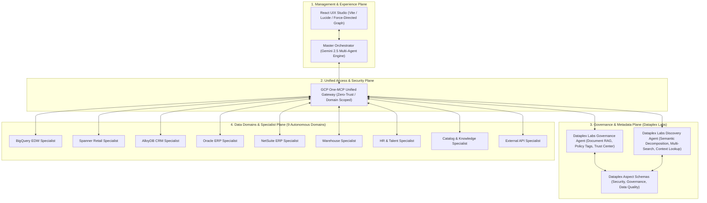

# MeshOS: Enterprise Autonomous Agentic Data Mesh on Google Cloud Platform (GCP)

[](https://cloud.google.com)
[](https://modelcontextprotocol.io)
[](https://github.com/GoogleCloudPlatform/dataplex-labs)
[](tests/integration)


## 📌 Executive Overview

**MeshOS** is a next-generation **Autonomous Agentic Data Mesh platform** built on **Google Cloud Platform (GCP)**. It bridges disparate enterprise databases, transactional systems, analytics warehouses, and SaaS platforms into a self-governing, collaborative multi-agent ecosystem. 

Powered by **Gemini 2.5 Flash / Pro**, the **Model Context Protocol (MCP)**, and official **Google Cloud Dataplex Labs** reference architectures, MeshOS enables autonomous cross-domain reasoning, automated metadata lineage propagation, zero-trust MCP tool federation, and real-time schema drift reconciliation.

---

## 🏛️ Core Architectural Pillars



---

## 🌐 The 9 Mesh Domains

MeshOS organizes enterprise data into 9 decentralized, autonomous domains with formal data contracts, lineage graphs, and specialized agents:

| Domain | Underlying Engine | Key Entities & Capabilities | Agent Specialist |
| :--- | :--- | :--- | :--- |
| **BigQuery Analytics** | Google Cloud BigQuery | `marketing_edw.customer_segments`, `campaign_performance`, `churn_risk` | `AnalyticsAgent` |
| **Spanner Retail** | Cloud Spanner + Graph | `Inventory`, `Transactions`, `Stores`, `Products`, Native Vector Index | `RetailAgent` |
| **AlloyDB CRM** | AlloyDB for PostgreSQL | `CRM_LEADS`, `CRM_ACCOUNTS`, `SUPPORT_TICKETS`, `pgvector` | `AnalyticsAgent` |
| **Oracle ERP** | Oracle DB@GCP / BMS | `ERP_PURCHASE_ORDERS`, `ERP_SUPPLIERS`, `ERP_EXPENSES`, Graph & Vector | `FinancialAgent` |
| **NetSuite ERP** | SuiteTalk / REST Connector | `SalesOrders`, `Invoices`, `Fulfillment`, `ItemReceipts` | `NetSuiteAgent` |
| **Warehouse** | Real-time Inventory Engine | `StockBatches`, `AisleBins`, `PalletMovements` | `WarehouseAgent` |
| **HR & Talent** | Sensitive HR Store | `Employees`, `Departments`, `HeadcountRequisitions`, DLP Masking | `HRAgent` |
| **Catalog & Knowledge** | Dataplex / Knowledge Catalog | `OpenKnowledgeGraph`, `DCATv3`, Aspect Types, Cross-Domain Links | `CatalogAgent` |
| **API Domain** | External Gateways | Dynamic OpenAPI / REST Endpoints, Vendor Data Ingestion | `ApiAgent` |

---

## ⚡ GCP One-MCP Unified Gateway

The **GCP One-MCP Gateway** (`servers/one-mcp/index.js`, `agent/utils/one_mcp_gateway.js`) provides a centralized, high-performance Zero-Trust access point for enterprise AI agents.

### Key Capabilities:
- **Unified Gateway Endpoint**: Aggregates 31+ specialized tools across BigQuery, Spanner, AlloyDB, Oracle DB, Dataplex, and NetSuite into a single manageable MCP service.
- **4 Runtime Operation Modes**:
  - `unified`: Single multi-service gateway routing with dynamic tool filtering.
  - `microservices`: Dedicated standalone MCP servers per database domain.
  - `local`: Direct in-process JavaScript driver execution.
  - `toolbox`: Enterprise MCP Toolbox for Databases integration.
- **Zero-Trust Scoping & RBAC**: Filters available tools dynamically based on agent domain credentials, preventing lateral data exfiltration.

---

## 🛡️ Dataplex Labs Data Governance Agent Integration

MeshOS natively integrates the **Google Cloud Dataplex Labs Governance Agent** (`agent/utils/governance_metadata_propagator.js`, `agent/utils/document_rag_engine.js`):

1. **Document RAG Engine & AI Data Steward**: Ingests unstructured Markdown, PDF, and JSON data dictionaries. Uses multimodal Gemini models to extract table schemas, column descriptions, and glossary terms.
2. **Lineage-Based Metadata Propagation**: Propagates descriptions across multi-hop pipelines with automatic SQL transformation detection (`COALESCE`, `SUM`, `CONCAT`, `CASE WHEN`, `SAFE_CAST`).
3. **AI Business Glossary & EntryLinks**: Recommends and binds business glossary terms to Dataplex entries with resilient local fallback (`config/glossary_links.json`).
4. **Policy Tag Propagation**: Detects straight-pull vs transformed columns to propagate sensitive data policy tags and generate authorized reader summaries.
5. **Data Trust Center (AutoDQ)**: Calculates derived multi-hop Data Quality scores with automated SQL remediation bonuses and historical trend tracking (`Improving`, `Stable`, `Degrading`).
6. **Dataplex Scans Management**: Dispatches and tracks Dataplex Data Quality and Profile scans (`config/dataplex_scans.json`).
7. **Estate Dashboard**: Real-time visibility into metadata gap percentages, documentation coverage, and enterprise trust indexes.

---

## 🔍 Dataplex Labs Knowledge Catalog Discovery Agent Integration

MeshOS integrates the **Dataplex Labs Knowledge Catalog Discovery Agent** (`agent/utils/knowledge_catalog_discovery_service.js`):

1. **Semantic Question Decomposition**: Translates high-level analytical and business inquiries into 3 distinct search variations:
   - *Variation 1 (Direct & Synonyms)*: Expanded business terms.
   - *Variation 2 (Technical Schema Translation)*: Translates business concepts (e.g. *customer acquisition*, *churn risk*) to technical database column patterns (`spend`, `gross_revenue`, `customer_profile`).
   - *Variation 3 (Category & Domain Context)*: Enterprise category expansion.
2. **Predicate Extraction**: Extracts and appends qualified search qualifiers (`type=table`, `system=bigquery`, `system=spanner`, `projectid=...`).
3. **Knowledge Catalog Multi-Search**: Executes concurrent semantic searches (`semantic_search: true`) across Google Cloud Knowledge Catalog and reranks entries.
4. **Context Lookup (`lookupContext`)**: Queries Knowledge Catalog to retrieve deep lineage, aspect attachments, and governance posture for discovered assets.

---

## 📊 Cross-Domain Inventory & Knowledge Graph UI

The **React UIX Studio** (`UIX/src/components/GovernanceView.tsx`) delivers an executive-grade command center:
- **Interactive Force-Directed Graph**: Visualizes cross-domain entity linkages, data contracts, and policy tag indicators.
- **AI Discovery & Multi-Search Studio**: Real-time interface for natural language decomposition, query variation preview, and asset reranking.
- **Data Trust Center**: Real-time DQ score breakdown, auto-remediation suggestions, and scan history.
- **Document RAG Workspace**: Upload and index data dictionaries and policy documents.
- **Aspect Schema Editor**: Live management of custom Dataplex aspect types (`governance`, `data_quality`, `security_privacy`).
- **W3C DCAT v3 / JSON-LD Export**: Interoperable semantic metadata export.

---

## 🚀 Quick Start Guide

### Prerequisites
- Node.js 20+
- Google Cloud SDK (`gcloud`)
- Gemini API Key / Google Cloud ADC

### 1. Installation
```bash
git clone https://github.com/GoogleCloudPlatform/agenticmesh.git
cd agenticmesh
npm install
cd UIX && npm install && cd ..
```

### 2. Environment Configuration
Create a `.env` file in the root directory:
```env
PORT=3000
GCP_PROJECT_ID="your-project-id"
GEMINI_API_KEY="your-gemini-api-key"
GCP_ONE_MCP_ENABLED="true"
ONE_MCP_MODE="unified"
DATAPLEX_ZONE_ID="europe-west3"
BIGQUERY_DATASET_ID="marketing_edw"
USE_REAL_CONNECTIONS="false"  # Set to true for live GCP databases
```

### 3. Run the Platform
```bash
# Start backend Express server + One-MCP Gateway + React UIX
npm run start:all
```
- **Web UI Studio**: `http://localhost:5173`
- **Express Backend API**: `http://localhost:3000`
- **GCP One-MCP SSE Gateway**: `http://localhost:8088/sse`

---

## 🧪 Testing & Verification

MeshOS maintains a 100% pass rate across unit, integration, and end-to-end suites:

```bash
# Run all 17 integration test suites (99 tests)
npm test

# Build production React UIX frontend
cd UIX && npm run build
```

---

## 📚 Documentation Index

- [Architecture & Flow Specification](docs/architecture_and_flow.md)
- [Agentic Data Mesh Design](docs/agentic_data_mesh_design.md)
- [GCP Deployment Blueprint](docs/gcp_deployment_blueprint.md)
- [Technical Deployment & Security Blueprint](docs/technical_deployment_blueprint.md)
- [MCP GraphRAG Grounding Design](docs/mcp_graphrag_design.md)
- [Interactive Demo Guide](docs/demo_guide.md)
- [Step-by-Step Walkthrough](docs/walkthrough_10_steps.md)
- [Architectural Whitepaper](docs/architect_article.md)

---

## 📄 License & Attribution
Licensed under the Apache 2.0 License. Built in alignment with the Google Cloud Dataplex Labs specifications.
