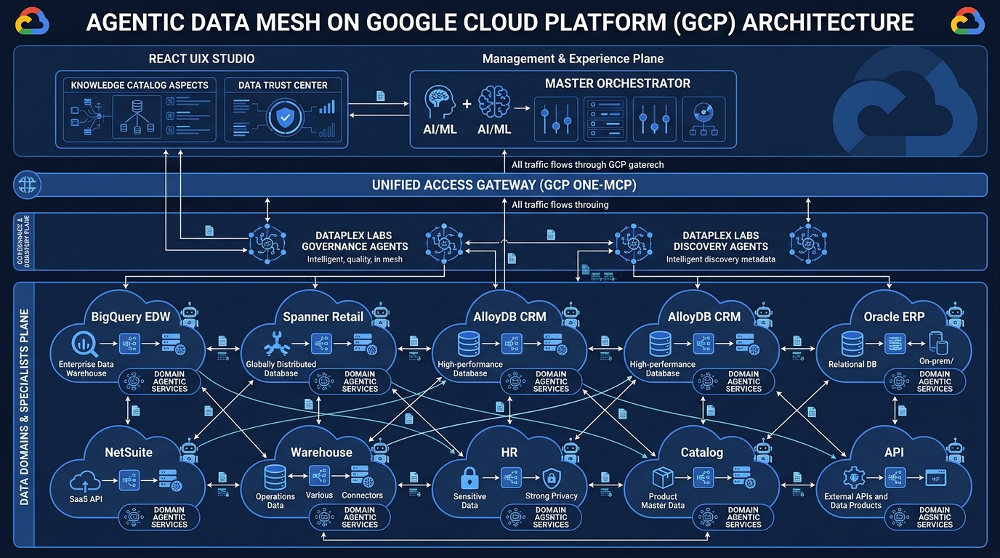
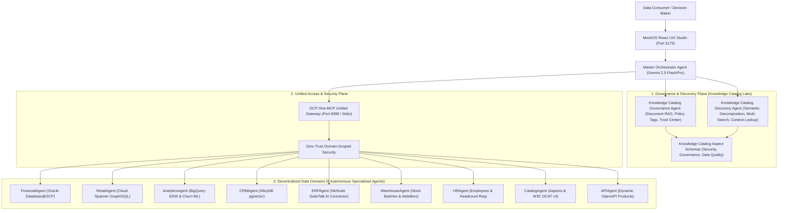

# Enterprise Agentic Data Mesh (MeshOS) on Google Cloud

[](https://opensource.org/licenses/Apache-2.0)
[](https://nodejs.org/)
[](https://react.dev/)
[](https://cloud.google.com/dataplex)
[-8A2BE2?style=for-the-badge)](https://modelcontextprotocol.io/)

---

## 🌟 Executive Overview

**MeshOS** is a multi-domain autonomous **Agentic Data Mesh Operating System** engineered for Google Cloud Platform (GCP). It elevates decentralized enterprise data from passive storage into active, intelligent cognitive products through domain-specific AI agents.

Powered by **Gemini 2.5 Flash / Pro**, the **Model Context Protocol (MCP)**, and official **Google Cloud Knowledge Catalog (Dataplex Labs)** reference architectures, MeshOS enables autonomous cross-domain reasoning, automated metadata lineage propagation, zero-trust MCP tool federation, and real-time schema drift reconciliation.



---

## 🏛️ System Architecture Topology



---

## 📦 The 9 Mesh Domains & Capabilities

| Domain | Underlying GCP / Enterprise Engine | Key Data Products & Schemas | Specialist Agent |
| :--- | :--- | :--- | :--- |
| **Oracle ERP** | Oracle Database@Google Cloud / Autonomous DB | `ERP_PURCHASE_ORDERS`, `ERP_SUPPLIERS`, `ERP_EXPENSES` | `FinancialAgent` |
| **Spanner Retail** | Google Cloud Spanner (Graph GQL & SQL) | `Stores`, `Products`, `Inventory`, `Transactions` | `RetailAgent` |
| **BigQuery Analytics** | Google Cloud BigQuery EDW & ML | `marketing_edw.customer_segments`, `churn_risk` | `AnalyticsAgent` |
| **AlloyDB CRM** | Google Cloud AlloyDB PostgreSQL (`pgvector`) | `CRM_LEADS`, `CRM_ACCOUNTS`, `SUPPORT_TICKETS` | `CRMAgent` |
| **NetSuite ERP** | NetSuite SuiteTalk REST AI Connector | `SalesOrders`, `Invoices`, `Fulfillment` | `ERPAgent` |
| **Warehouse** | Real-Time Supply Chain Persistence | `StockBatches`, `AisleBins`, `PalletMovements` | `WarehouseAgent` |
| **HR & Talent** | Human Resources Directory (Confidential) | `Employees`, `Departments`, `HeadcountRequisitions` | `HRAgent` |
| **Catalog & Knowledge** | Google Cloud Knowledge Catalog | `OpenKnowledgeGraph`, `DCATv3`, Aspect Types, Cross-Domain Links | `CatalogAgent` |
| **API Domain** | Dynamic OpenAPI Ingestion Feeds | Registered 3rd Party APIs, Partner Feeds | `APIAgent` |

---

## ⚡ GCP One-MCP Unified Gateway

The **GCP One-MCP Gateway** (`servers/one-mcp/index.js`, `agent/utils/one_mcp_gateway.js`) establishes a single, consolidated Zero-Trust integration plane:

- **Unified Gateway Endpoint**: Aggregates 31+ specialized tools across BigQuery, Spanner, AlloyDB, Oracle DB, Knowledge Catalog, and NetSuite into a single manageable MCP service.
- **Dynamic Domain Scoping**: Restricts available tools dynamically based on calling agent domain identity, preventing lateral security vulnerabilities.
- **4 Runtime Modes**:
  - `unified`: Single multi-tool MCP server (Port 8088 / SSE).
  - `microservices`: Decentralized independent MCP services per domain.
  - `local`: Stdio-spawned sub-processes for isolated offline CLI workflows.
  - `toolbox`: Dynamic tool registry integration.

---

## 🛡️ Knowledge Catalog Data Governance Agent Integration

MeshOS natively integrates the **Google Cloud Knowledge Catalog Governance Agent** (`agent/utils/governance_metadata_propagator.js`, `agent/utils/document_rag_engine.js`):

1. **Document RAG Data Steward**: Gemini multimodal extraction pipeline converting unstructured Markdown, PDFs, and schema dictionaries into structured table schemas and column definitions.
2. **Lineage-Based Metadata Propagation**: Propagates upstream column descriptions downstream with SQL transformation analysis (`COALESCE`, `SUM`, `CASE WHEN`).
3. **AI Business Glossary & EntryLinks**: Recommends and binds business glossary terms to Knowledge Catalog entries with resilient local fallback (`config/glossary_links.json`).
4. **Data Trust Center (AutoDQ)**: Derives multi-hop Data Quality scores with automated SQL remediation bonuses and historical trend tracking.
5. **Estate Summary Dashboard**: Real-time visibility into mesh-wide documentation gaps and trust indices.
6. **Knowledge Catalog Scans Management**: Dispatches and tracks Data Quality and Profile scans (`config/dataplex_scans.json`).

---

## 🔍 Knowledge Catalog Discovery Agent Integration

MeshOS integrates the **Knowledge Catalog Discovery Agent** (`agent/utils/knowledge_catalog_discovery_service.js`):

1. **Semantic Question Decomposition**: Translates natural language inquiries into 3 distinct search variations (direct synonyms, database column patterns, category breadth).
2. **Predicate Extraction**: Extracts search qualifiers (`type=table`, `system=bigquery`, `system=spanner`, `projectid=...`).
3. **Knowledge Catalog Multi-Search**: Executes concurrent semantic searches with cross-engine reranking.
4. **Context Lookup (`lookupContext`)**: Calls Knowledge Catalog `LookupContext` API for batch resources to retrieve lineage, aspects, and trust index.

---

## 🖥️ MeshOS React UIX Studio

The modern web studio (`UIX/`) offers enterprise observability:

- **Real-Time Orchestration Console**: Interactive natural language query interface with live A2A timeline, step-by-step reasoning logs, and confidence score badges.
- **Force-Directed Graph**: Visualizes cross-domain relationships, policy tags (`PII`, `FINANCIAL`), and data contract SLAs.
- **Data Trust Center**: Comprehensive Data Quality dashboard, aspect editor, and scan dispatcher.
- **W3C DCAT v3 / JSON-LD Export**: Standardized linked data catalog representation.

---

## 🚀 Quick Start Guide

### Prerequisites
- Node.js `>= 20.0.0`
- Google Cloud SDK (`gcloud`) with ADC configured (`gcloud auth application-default login`)
- A valid Gemini API Key (`GEMINI_API_KEY`)

### Environment Setup
Create a `.env` file in the root directory:
```bash
GEMINI_API_KEY="your-gemini-api-key"
GCP_PROJECT_ID="your-gcp-project-id"
GCP_REGION="europe-west3"
KNOWLEDGE_CATALOG_LOCATION="europe-west3"
MCP_GATEWAY_MODE="unified"
ONE_MCP_PORT=8088
PORT=8080
```

### Installation & Execution
```bash
# 1. Install dependencies
npm install
cd UIX && npm install && cd ..

# 2. Run full test suite (99 tests across 17 test suites)
npm test

# 3. Build frontend studio
cd UIX && npm run build && cd ..

# 4. Launch MeshOS (Backend API + One-MCP Gateway + UIX Studio)
npm run start:all
```

Open [http://localhost:5173](http://localhost:5173) in your browser.

---

## 🧪 Testing & Verification

```bash
# Run all integration test suites
npm test

# Run Knowledge Catalog Governance Agent tests
node --test tests/integration/dataplex_labs_governance_agent.test.js

# Run Knowledge Catalog Discovery Agent tests
node --test tests/integration/dataplex_labs_discovery_agent.test.js

# Run GCP One-MCP Gateway tests
node --test tests/integration/one_mcp_gateway.test.js
```

---

## 📄 License & Standards

Licensed under the Apache 2.0 License. Built in alignment with the Google Cloud Knowledge Catalog (Dataplex Labs) specifications.
