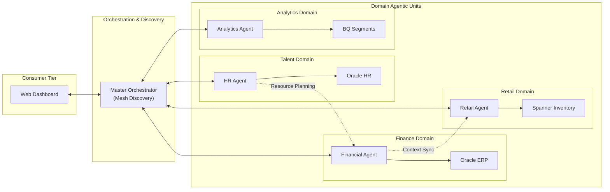

# Agentic Data Mesh Architecture

This document defines the strategic architecture for an **Agentic Data Mesh**. It evolves the standard Data Mesh principles by introducing **Autonomous Data Agents** as the primary interface for data consumption and governance.

## Core Pillars of the Agentic Mesh

### 1. Decentralized Domain Ownership

Data is not stored in a central lake but owned by domain-specific agents.

- **Financial Agent:** Owns the Oracle ERP domain (Invoices, Suppliers).
- **Retail Agent:** Owns the Spanner Global domain (Inventory, Transactions).
- **HR Agent:** Owns the Oracle HR domain (Employees, Recruitment).
- **Analytics Agent:** Owns the BigQuery/AlloyDB domain (Segments, CRM).

### 2. Data as a Product (Agent-Agnostic Access)

Each agent exposes their domain data as a "Product" via standardized MCP (Model Context Protocol) interfaces.

- Agents don't just return rows; they return **Contextual Insights**.
- Discovery is handled by the **Master Orchestrator** (the mesh directory).

### 3. Self-Serve Agentic Infrastructure

The mesh is powered by a common infrastructure layer:

- **GCP Foundation:** AlloyDB, Spanner, BigQuery, and Oracle DB@GCP.
- **Orchestration Layer:** Express API serving as the gateway.
- **Communication Protocol:** A2A (Agent-to-Agent) messaging via Gemini 1.5 Flash.

### 4. Federated Computational Governance

Policy and security are applied globally but executed locally by agents.

- **Security:** Google Cloud ADC (Application Default Credentials).
- **Auditability:** Every step in the `AgentChain` is logged and verifiable.
- **Quality:** Agents validate data against domain-specific logical schemas before responding.

## High-Level Mesh Topology

## Strategic Advantages

- **Infinite Scalability:** Add a new "Supply Chain Agent" by simply registering it in the Orchestrator.
- **Reduced Latency:** Reasoning happens at the domain level; only synthesized insights travel the network.
- **Native Intelligence:** The mesh doesn't just store data; it understands the *meaning* of the data within its domain.
