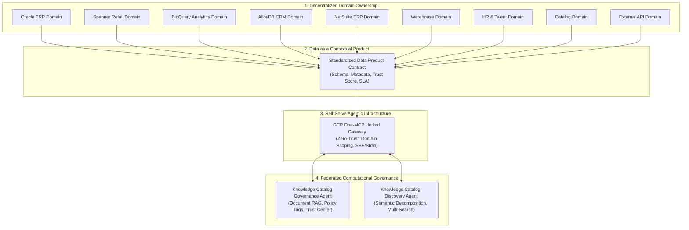

# Strategic Architecture: Enterprise Agentic Data Mesh (MeshOS)

This document defines the strategic and technical architecture for an **Autonomous Agentic Data Mesh (MeshOS)**. It evolves Martin Fowler and Zhamak Dehghani's foundational Data Mesh principles by introducing **Autonomous AI Agents**, **Model Context Protocol (MCP)** gateways, and **Google Cloud Knowledge Catalog (Dataplex Labs)** automated governance.


---

## The Four Core Pillars of the Agentic Mesh


```mermaid
graph TD
    subgraph "1. Decentralized Domain Ownership"
        D1["Oracle ERP Domain"]
        D2["Spanner Retail Domain"]
        D3["BigQuery Analytics Domain"]
        D4["AlloyDB CRM Domain"]
        D5["NetSuite ERP Domain"]
        D6["Warehouse Domain"]
        D7["HR & Talent Domain"]
        D8["Catalog Domain"]
        D9["External API Domain"]
    end

    subgraph "2. Data as a Contextual Product"
        Contracts["Standardized Data Product Contract<br/>(Schema, Metadata, Trust Score, SLA)"]
    end

    subgraph "3. Self-Serve Agentic Infrastructure"
        OneMCP["GCP One-MCP Unified Gateway<br/>(Zero-Trust, Domain Scoping, SSE/Stdio)"]
    end

    subgraph "4. Federated Computational Governance"
        Gov["Knowledge Catalog Governance Agent<br/>(Document RAG, Policy Tags, Trust Center)"]
        Disc["Knowledge Catalog Discovery Agent<br/>(Semantic Decomposition, Multi-Search)"]
    end

    D1 & D2 & D3 & D4 & D5 & D6 & D7 & D8 & D9 --> Contracts
    Contracts --> OneMCP
    OneMCP <--> Gov & Disc
```

---

## 1. Decentralized Domain Ownership (9 Autonomous Units)

Data is not funneled into a brittle centralized data lake. Instead, each domain operates an autonomous, specialized AI agent unit responsible for its own storage, queries, and business rules:

1. **Financial Agent**: Owns Oracle ERP (`ERP_PURCHASE_ORDERS`, `ERP_SUPPLIERS`, `ERP_EXPENSES`), Oracle Graph, and Oracle Vector Search.
2. **Retail Agent**: Owns Cloud Spanner (`Inventory`, `Transactions`, `Stores`, `Products`), Spanner Graph, and Vector Similarity.
3. **Analytics Agent**: Owns BigQuery (`marketing_edw.customer_segments`, `churn_risk`) and AlloyDB (`CRM_LEADS`, `SUPPORT_TICKETS`).
4. **NetSuite Agent**: Owns NetSuite SaaS ERP records via SuiteTalk REST interfaces (`SalesOrders`, `Invoices`, `Fulfillment`).
5. **Warehouse Agent**: Owns real-time inventory movements (`StockBatches`, `AisleBins`, `PalletMovements`).
6. **HR & Talent Agent**: Owns sensitive employee directory and recruiting records (`Employees`, `Departments`, `HeadcountRequisitions`) with DLP masking.
7. **Catalog Agent**: Owns Knowledge Catalog Aspect Schemas, cross-domain relationship graphs, and W3C DCAT v3 linked data.
8. **API Agent**: Owns dynamic external API integrations and third-party data products.

---

## 2. Data as a Product (Contract-Driven AI Exchange)

Agents in the mesh communicate using standardized **Data Product Contracts** rather than exchanging raw tabular dumps:

```json
{
  "domain": "Spanner Retail",
  "data": {
    "storeId": "STORE_101",
    "stockLevel": 450,
    "reorderThreshold": 1200,
    "status": "CRITICAL_LOW"
  },
  "metadata": {
    "confidence": 0.98,
    "source": "spanner.inventory",
    "lineageHop": 1,
    "policyTag": "PUBLIC"
  },
  "insights": "Store 101 has critically low stock for SKU-900 due to Supplier S-400 shipping delays in Oracle ERP.",
  "dataTrustScore": 0.96
}
```

---

## 3. Self-Serve Agentic Infrastructure (GCP One-MCP Gateway)

MeshOS provides a shared, self-serve connectivity plane through the **GCP One-MCP Gateway** (`servers/one-mcp/index.js`):
- **Universal Tool Aggregation**: Aggregates 31+ domain tools into a unified endpoint.
- **Dynamic Domain Scoping**: Restricts access so that an agent cannot execute unauthorized tools outside its designated domain boundary.
- **Multi-Transport Support**: Compatible with SSE (port 8088) and standard I/O for Cloud Run sidecar deployments.

---

## 4. Federated Computational Governance (Knowledge Catalog Labs)

Governance in MeshOS is automated, continuous, and computationally enforced:
- **Document RAG Data Steward**: Ingests unstructured policies and schema dictionaries to extract canonical business definitions.
- **Lineage-Based Description Propagation**: Automatically updates downstream table and column documentation with SQL transformation rationales (`COALESCE`, `SUM`, `CASE WHEN`).
- **Data Trust Center (AutoDQ)**: Derives multi-hop Data Quality scores with automated remediation bonuses and historical trend tracking.
- **Semantic Question Decomposition**: Uses the Knowledge Catalog Discovery Agent to decompose user questions into 3 distinct search variations and extracted predicates.
- **Semantic Catalog Federation**: Exposes mesh assets via **W3C DCAT v3** and **Google Open Knowledge Graph** JSON-LD linked data.
