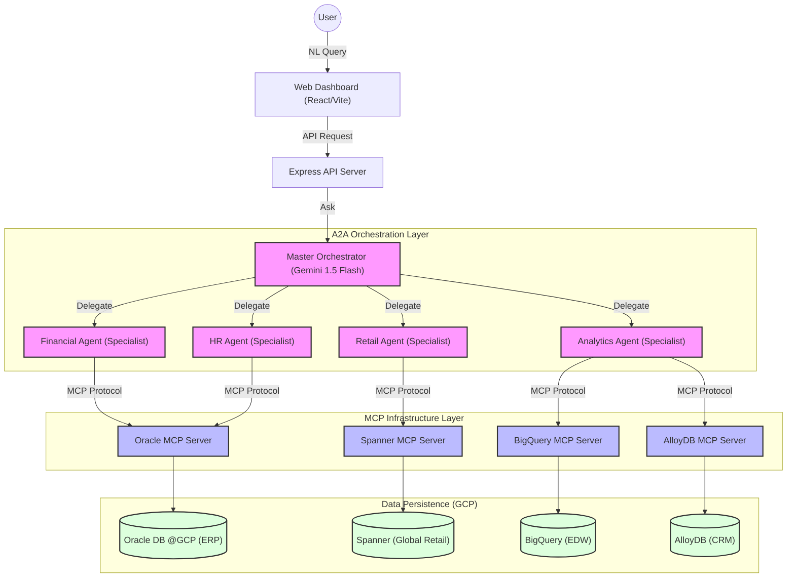
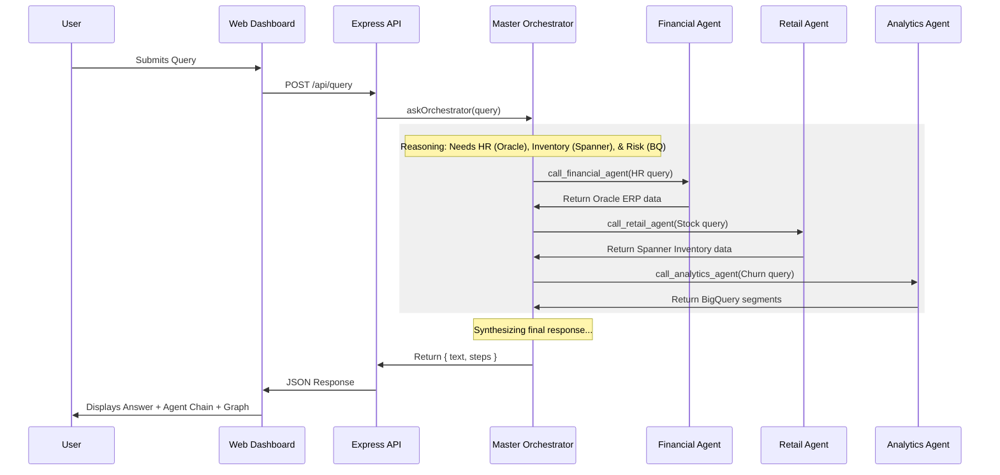

# Enterprise Data Agents Solution Architecture

This document provides a high-level overview of the Multi-Domain Data Agent (A2A) orchestration system, including the system architecture and the process flow for a typical user query.

## Systems Architecture

The system is built on a modular, Agent-to-Agent (A2A) architecture. A Master Orchestrator delegates specialized tasks to sub-agents, each responsible for a specific data domain.

## Process Flow: Cross-Domain Query

The following sequence diagram illustrates the end-to-end flow of a complex, cross-domain query (e.g., "Analyze how recruitment delays in Oracle are affecting the Spanner Global supply chain based on BigQuery churn risk").

## Key Components

### 1. Web Dashboard (React + Vite)

- **Search Component:** Captures natural language queries.
- **Agent Chain:** Real-time visualization of the A2A reasoning steps and delegations.
- **Graph View:** Visualizes relationships between data nodes retrieved from different domains.

### 2. Master Orchestrator

- **Logic:** Uses Gemini 1.5 Flash to decompose queries.
- **Tools:** Defined as sub-agent delegation functions (`call_financial_agent`, etc.).
- **Synthesis:** Aggregates raw data from sub-agents into a human-readable strategic insight.

### 3. Specialized Sub-Agents

- **Financial Agent:** Expert in Oracle ERP schemas, Graph, and Vector search.
- **Retail Agent:** Expert in Spanner's distributed relational and graph capabilities.
- **Analytics Agent:** Expert in high-performance BigQuery analysis and AlloyDB CRM data.

### 4. MCP Servers

- Standardized interfaces that allow sub-agents to communicate with various database technologies securely and uniformly.
