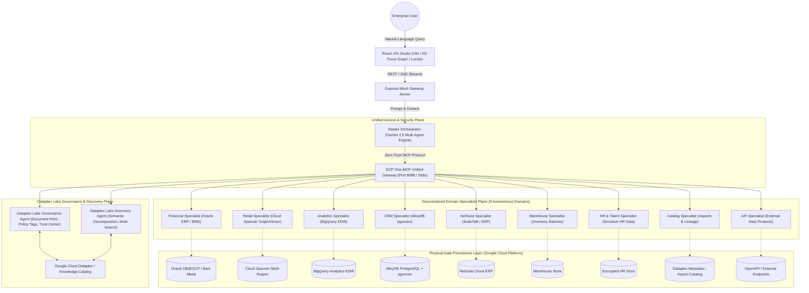
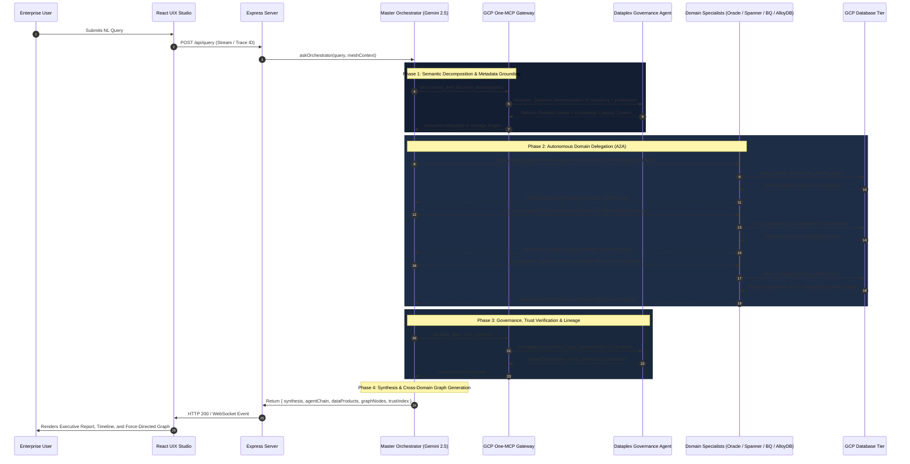

# Enterprise Agentic Data Mesh Solution Architecture & Flow Specification

This document provides a comprehensive technical overview of the **MeshOS** multi-domain Agent-to-Agent (A2A) orchestration system, including high-level architecture, unified MCP gateway topology, governance and discovery pipelines, and cross-domain query lifecycle.

---

## 1. High-Level Systems Architecture

MeshOS decomposes the enterprise data stack into four decoupled architectural planes:

```mermaid
graph TD
    User((Enterprise User)) -->|Natural Language Query| WebUI["React UIX Studio (Vite / D3 Force Graph / Lucide)"]
    WebUI -->|REST / SSE Streams| API["Express Mesh Gateway Server"]
    API -->|Prompt & Context| MasterOrch["Master Orchestrator (Gemini 2.5 Multi-Agent Engine)"]

    subgraph "Unified Access & Security Plane"
        MasterOrch -->|Zero-Trust MCP Protocol| OneMCP["GCP One-MCP Unified Gateway (Port 8088 / Stdio)"]
    end

    subgraph "Dataplex Labs Governance & Discovery Plane"
        OneMCP --> GovAgent["Dataplex Labs Governance Agent (Document RAG, Policy Tags, Trust Center)"]
        OneMCP --> DiscAgent["Dataplex Labs Discovery Agent (Semantic Decomposition, Multi-Search)"]
        GovAgent & DiscAgent <--> DataplexService["Google Cloud Dataplex / Knowledge Catalog"]
    end

    subgraph "Decentralized Domain Specialists Plane (9 Autonomous Domains)"
        OneMCP --> FinAgent["Financial Specialist (Oracle ERP / BMS)"]
        OneMCP --> RetailAgent["Retail Specialist (Cloud Spanner Graph/Vector)"]
        OneMCP --> AnalyticsAgent["Analytics Specialist (BigQuery EDW)"]
        OneMCP --> CRMAgent["CRM Specialist (AlloyDB pgvector)"]
        OneMCP --> NSAgent["NetSuite Specialist (SuiteTalk / ERP)"]
        OneMCP --> WHAgent["Warehouse Specialist (Inventory Batches)"]
        OneMCP --> HRAgent["HR & Talent Specialist (Sensitive HR Data)"]
        OneMCP --> CatAgent["Catalog Specialist (Aspects & Lineage)"]
        OneMCP --> ApiAgent["API Specialist (External Data Products)"]
    end

    subgraph "Physical Data Persistence Layer (Google Cloud Platform)"
        FinAgent -.-> OracleDB[("Oracle DB@GCP / Bare Metal")]
        RetailAgent -.-> SpannerDB[("Cloud Spanner Multi-Region")]
        AnalyticsAgent -.-> BigQueryDB[("BigQuery Analytics EDW")]
        CRMAgent -.-> AlloyDB[("AlloyDB PostgreSQL + pgvector")]
        NSAgent -.-> NetSuiteAPI[("NetSuite Cloud ERP")]
        WHAgent -.-> WarehouseDB[("Warehouse Store")]
        HRAgent -.-> HRDB[("Encrypted HR Store")]
        CatAgent -.-> KnowledgeStore[("Dataplex Metadata / Aspect Catalog")]
        ApiAgent -.-> OpenAPIEndpoint[("OpenAPI / External Endpoints")]
    end
```

---

## 2. End-to-End Cross-Domain Query Flow

The following sequence diagram details the full query execution lifecycle for a cross-domain strategic prompt:
*“Analyze how supplier delivery delays in Oracle ERP and stockouts in Spanner Retail correlate with VIP customer churn risk in BigQuery and CRM support escalation in AlloyDB.”*

```mermaid
sequenceDiagram
    autonumber
    participant U as Enterprise User
    participant UI as React UIX Studio
    participant API as Express Server
    participant ORCH as Master Orchestrator (Gemini 2.5)
    participant MCP as GCP One-MCP Gateway
    participant GOV as Dataplex Governance Agent
    participant SPEC as Domain Specialists (Oracle / Spanner / BQ / AlloyDB)
    participant DB as GCP Database Tier

    U->>UI: Submits NL Query
    UI->>API: POST /api/query (Stream / Trace ID)
    API->>ORCH: askOrchestrator(query, meshContext)

    rect rgb(20, 30, 50)
        Note over ORCH,MCP: Phase 1: Semantic Decomposition & Metadata Grounding
        ORCH->>MCP: decompose_and_discover_assets(query)
        MCP->>GOV: Semantic Question Decomposition (3 variations + predicates)
        GOV-->>MCP: Returns Ranked Assets + Knowledge Catalog Context
        MCP-->>ORCH: Grounded Metadata & Lineage Graph
    end

    rect rgb(30, 45, 70)
        Note over ORCH,SPEC: Phase 2: Autonomous Domain Delegation (A2A)
        ORCH->>SPEC: call_financial_agent("Retrieve overdue POs from ERP_PURCHASE_ORDERS")
        SPEC->>DB: query_oracle_sql & query_oracle_graph
        DB-->>SPEC: Oracle Supplier Delays & Graph Links
        SPEC-->>ORCH: Standardized Data Product (Domain: Oracle ERP)

        ORCH->>SPEC: call_retail_agent("Check inventory stockouts for affected SKU batches")
        SPEC->>DB: query_spanner_sql & Spanner Graph traversal
        DB-->>SPEC: Spanner Inventory Shortage by Store
        SPEC-->>ORCH: Standardized Data Product (Domain: Spanner Retail)

        ORCH->>SPEC: call_analytics_agent("Correlate with High-Value Churn Segments")
        SPEC->>DB: query_bigquery & query_alloydb_sql
        DB-->>SPEC: BigQuery High-Risk VIPs + AlloyDB Escalation Tickets
        SPEC-->>ORCH: Standardized Data Product (Domain: BigQuery / AlloyDB)
    end

    rect rgb(25, 40, 60)
        Note over ORCH,GOV: Phase 3: Governance, Trust Verification & Lineage
        ORCH->>MCP: calculate_data_trust_scores()
        MCP->>GOV: Propagate DQ & Policy Tags (Straight-Pull vs Transform)
        GOV-->>MCP: Verified Trust Index (96%), Zero-Drift Certification
        MCP-->>ORCH: Governance Attestation
    end

    Note over ORCH: Phase 4: Synthesis & Cross-Domain Graph Generation
    ORCH->>API: Return { synthesis, agentChain, dataProducts, graphNodes, trustIndex }
    API->>UI: HTTP 200 / WebSocket Event
    UI->>U: Renders Executive Report, Timeline, and Force-Directed Graph
```

---

## 3. Core Subsystem Architectures

### 3.1 Master Orchestrator
- **Model Backbone**: Gemini 2.5 Flash / Pro with function calling and structured outputs.
- **Dynamic Context Fusion**: Maintains a shared blackboard state across sequential tool invocations. Subsequent agent calls automatically inherit upstream factual grounding.
- **Data Contract Enforcement**: Validates every agent output against the structural `DataProductContract` (schema validity, domain bounding, metadata provenance, and trust confidence).

### 3.2 GCP One-MCP Unified Gateway
- **Architecture**: Single managed Node.js service exposing MCP over Server-Sent Events (SSE) on port 8088 and standard I/O for container sidecars.
- **Domain Scoping**: Enforces Zero-Trust isolation. The `BigQuery Analytics` agent is scoped strictly to BigQuery and AlloyDB tools, preventing unauthorized lateral execution against `Oracle ERP` or `HR` systems.
- **Fallback Engine**: Resilient fallback to local drivers and simulated catalogs when operating in offline testing or air-gapped environments.

### 3.3 Google Cloud Dataplex Labs Governance Agent
- **Document RAG**: Multimodal extraction pipeline parsing unstructured PDF, Markdown, and JSON data dictionaries.
- **Lineage-Based Metadata Propagation**: Automatically carries upstream column descriptions and business definitions downstream, appending SQL transformation rationales.
- **Data Trust Center**: Derived multi-hop Data Quality calculations with automated SQL quality bonus factors (`COALESCE` $+8\%$, `DISTINCT` $+4\%$, `SAFE_CAST` $+5\%$) and drift tracking.

### 3.4 Google Cloud Dataplex Labs Discovery Agent
- **Semantic Decomposition**: Generates 3 query variations (direct synonym, database schema translation, and category breadth) with extracted predicates.
- **Knowledge Catalog Search**: Concurrent semantic search (`semantic_search: true`) across Dataplex global catalog with cross-engine reranking.
- **Context Lookup**: Invokes Dataplex `LookupContext` API to retrieve deep lineage, aspect attachments, and asset trust.

### 3.5 React UIX Studio & Cross-Domain Inventory
- **Technology Stack**: React 19, Vite, Tailwind CSS, Lucide, D3 / SVG Force-Directed Canvas.
- **Modules**:
  1. *Real-time Orchestration Console*: Interactive natural language querying and agent timeline inspector.
  2. *Cross-Domain Inventory*: Force-directed graph rendering relationships across all 9 domains with policy tag indicators and schema drift badges.
  3. *Governance & Dataplex Studio*: Estate dashboard, Document RAG repository, Data Trust Center, and Aspect Schema editor.
  4. *AI Semantic Discovery Studio*: Natural language question decomposition and ranked catalog asset browser.
  5. *W3C DCAT v3 / JSON-LD Catalog*: Standardized linked data metadata export.
