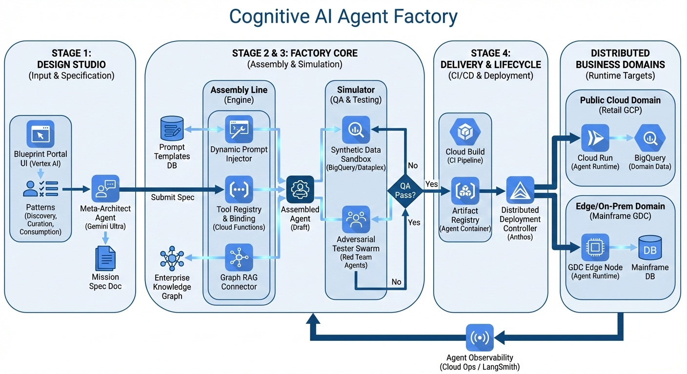
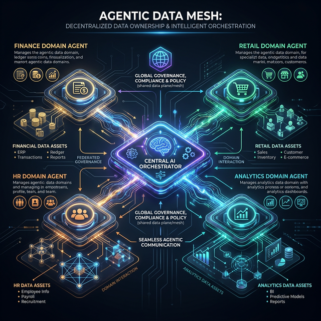
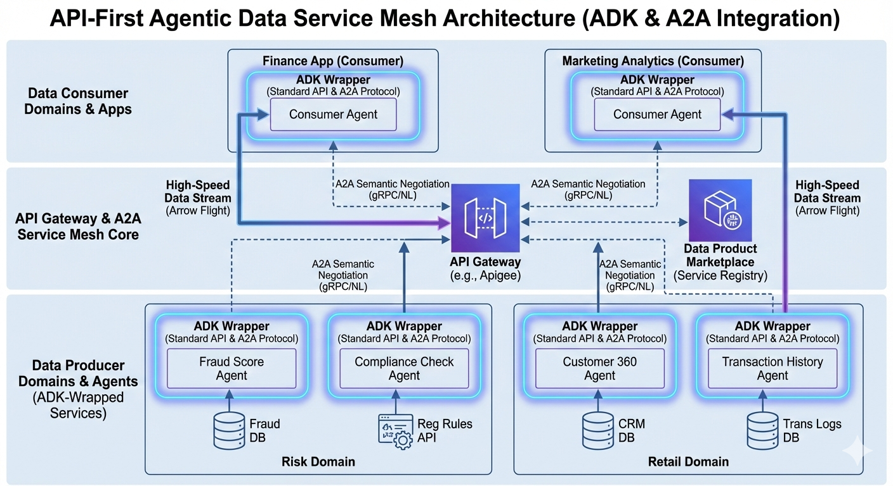
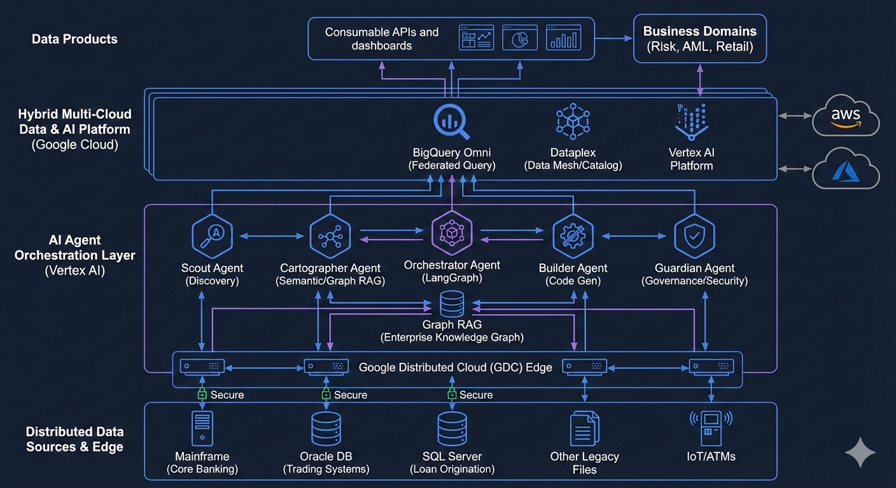
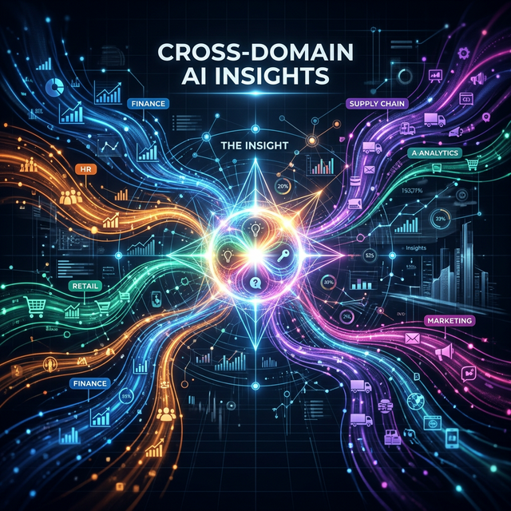
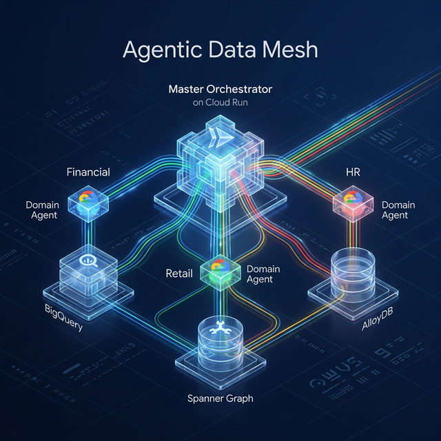

# The Architect’s Guide to the Agentic Data Mesh (MeshOS)

**Author:** Senior Cloud & AI Architect  
**Series:** Part 1-3: From Data Silos to Autonomous Intelligence

---

## Part 1: The Blueprint — Beyond the Data Lake

For decades, enterprise data strategy has been a battle between centralization (Data Lakes/Warehouses) and accessibility. We’ve reached a breaking point where the volume and variety of data outpace our ability to govern it centrally. Enter the **Agentic Data Mesh**.

### The Shift to Decentralized Intelligence
The core philosophy of MeshOS is a radical departure from traditional "Single Source of Truth" architectures. Instead of moving data to a central repository, we move **Intelligence to the Data**. This is the **Cognitive Factory** model: a decentralized network where each domain (Finance, Retail, HR, Analytics) owns its data and provides it as a high-value "Agentic Product."

*Figure 1: The Cognitive Factory model decentralizing intelligence across the enterprise.*

### The Four Pillars of MeshOS
As an architect, the beauty of this system lies in its four foundational pillars:
1. **Decentralized Domain Ownership:** Data is not a passive asset; it’s owned by a domain-specific agent (e.g., the Financial Agent owns Oracle ERP).
2. **Data as an Agentic Product:** Agents don’t just return raw rows; they return **grounded insights** validated against strict Data Contracts.
3. **Self-Serve Infrastructure:** A unified GCP foundation (Spanner, BigQuery, AlloyDB) provides the "rails" for these agents to communicate.
4. **Federated Governance:** Policies are global, but execution is local. Every step in the reasoning chain is auditable and secure via Google Cloud ADC.

*Figure 2: The high-level topology of the Agentic Data Mesh.*

---

## Part 2: The Engine — Orchestration, A2A, and MCP

If Part 1 is the blueprint, Part 2 is the engine. How do these decentralized agents actually talk to each other? The answer lies in the **A2A (Agent-to-Agent) Orchestration Layer** and the **Model Context Protocol (MCP)**.

### The Master Orchestrator (The MeshOS Brain)
The Master Orchestrator doesn't need to know every SQL table in your enterprise. Instead, it interacts with an **Agentic Catalog**. When a complex query arrives, the Orchestrator generates a **Strategic Plan**, decomposing the request into tasks for specialized sub-agents.

### Standardizing the Interface with MCP
The Model Context Protocol (MCP) is the "USB-C" of this architecture. It provides a standardized, secure way for agents to interface with any database. Whether it's an Oracle Graph traversal, a Spanner SQL query, or a BigQuery analytical scan, the interface is uniform.

*Figure 3: The API-first approach to building an interconnected agentic mesh.*

### A2A Synergy: Context Fusion
One of the most powerful features of MeshOS is **Context Fusion**. As the Retail Agent identifies a stock delay in Spanner, it passes that insight to the Financial Agent. The Financial Agent then automatically adjusts its Oracle ERP report to account for the supply chain risk. This is **Autonomous Synergy** in action.

*Figure 4: Domain-specific agents collaborating through the A2A layer.*

---

## Part 3: The Reality — Grounding, Governance, and Anti-Guessing

In the final part of our series, we look at how MeshOS moves from a technical marvel to a production-ready enterprise reality. This is achieved through the **"Anti-Guessing" (AntiG) Protocol**—more formally known as **GraphRAG Grounding**.

### GraphRAG: Verifiable Reasoning
The "AntiG" philosophy is simple: AI must never guess. By implementing GraphRAG, every insight provided by an agent is anchored in a verifiable database path. If the Retail Agent says a shipment is delayed, it cites the exact `Supplier -> PO -> Shipment` graph path from Cloud Spanner.

*Figure 5: Cross-domain insights grounded in real-time graph traversals.*

### Governance at Scale
The mesh handles governance through **Data Contracts** and **Mesh Context Filters**. Before data moves between domains, it is filtered to ensure privacy (e.g., HR data doesn't bleed into Finance). This federated approach allows for rapid scaling without compromising security.

### Real-World Impact: The Cross-Domain Challenge
Imagine a CEO asking: *"How are recruitment delays in HR affecting our Spanner Global supply chain for high-value customers in BigQuery?"*

In a traditional architecture, this would take weeks of manual data engineering. In MeshOS, it’s a single autonomous cycle:
1. **CatalogAgent** finds the domains.
2. **HRAgent** finds the delays.
3. **AnalyticsAgent** finds the customers.
4. **RetailAgent** traverses the graph to find the stock link.
5. **Orchestrator** synthesizes the answer.

*Figure 6: The final vision of the GCP Agentic Data Mesh—a masterpiece of modern engineering.*

### Conclusion
The Agentic Data Mesh isn't just a new way to store data; it's a new way to **think** with data. By decentralizing intelligence and grounding it in verifiable graphs, we are building the foundation for the truly autonomous enterprise.

---
**The future of data isn't a lake; it's a mesh.**
