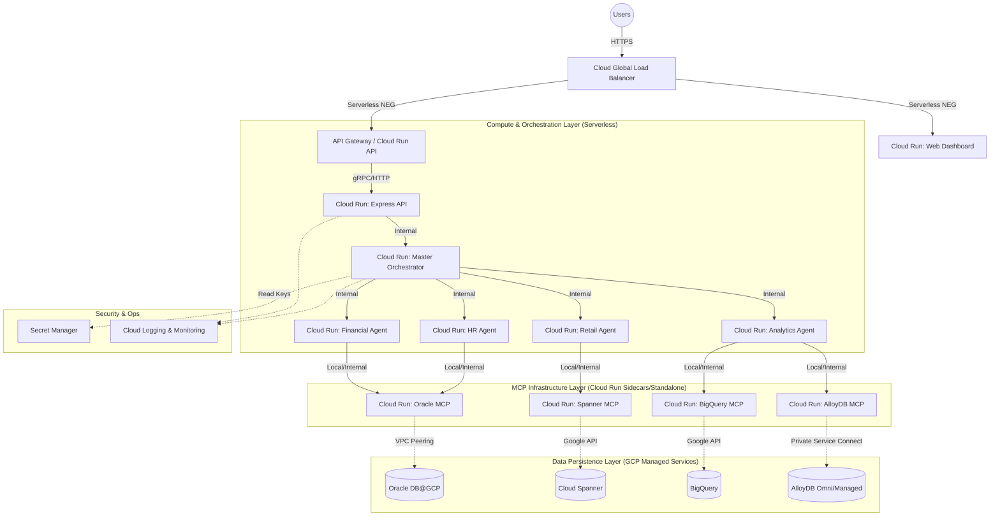
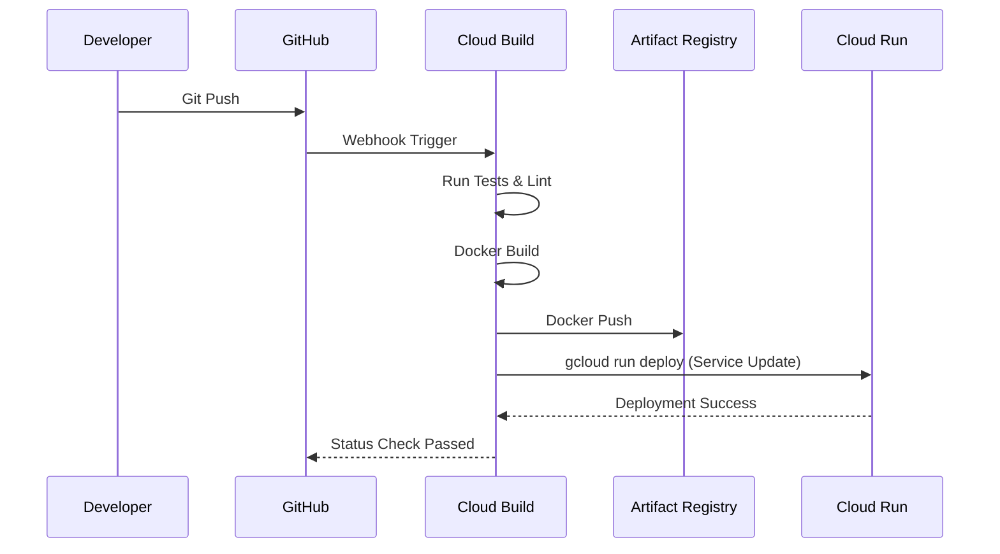

# Enterprise Data Agents - GCP Deployment Blueprint

This document outlines the professional architecture deployment blueprint for the Enterprise Data Agents (A2A) orchestration system on Google Cloud Platform (GCP). It encompasses compute, data, networking, security, and CI/CD best practices designed for enterprise scalability and reliability.

## 1. High-Level Component Deployment Architecture

The deployment architecture leverages managed, serverless, and highly scalable GCP services to minimize operational overhead while maximizing performance and security.

## 2. Compute & Orchestration Layer

Given the stateless nature of the agents and the Node.js/Express stack, **Google Cloud Run** is the recommended compute platform.

* **Web Dashboard UI**: Deployed to Cloud Run (if SSR via Next.js) or Firebase Hosting (if static SPA via Vite).
* **API & Orchestrator**: Cloud Run services configured to scale to zero to minimize costs during idle times, with provisioned concurrency configured for production to eliminate cold starts.
* **Domain Agents**: Deployed as independent Cloud Run microservices. This allows independent scaling based on domain query volume (e.g., Analytics Agent scaling higher during reporting periods).
* **MCP Servers**: Can be deployed either as **Cloud Run Multi-container components (Sidecars)** tightly coupled to specific agents to minimize latency, or as separate internal Cloud Run services if shared across multiple agents.

## 3. Database & Storage Layer

The core of the Data Mesh relies on managed databases.

* **Spanner (Retail)**: Multi-region configuration for global availability. Accessible via standard Google Cloud APIs.
* **BigQuery (Analytics)**: Serverless enterprise data warehouse. Configured with appropriate datasets and IAM roles.
* **AlloyDB (CRM)**: Highly available PostgreSQL-compatible database. Exposed via Private Service Connect (PSC) or Serverless VPC Access for secure internal routing from Cloud Run.
* **Oracle DB@GCP (ERP/HR)**: Oracle Exadata Database Service hosted on GCP. Requires VPC Peering from the Cloud Run instances to access the Exadata infrastructure.

## 4. Networking and Security Blueprint

Security is paramount for an enterprise data mesh handling cross-domain data.

### 4.1 Networking

* **Ingress**: Cloud Global Load Balancer (GLB) with Cloud Armor (WAF) to protect the frontend and public API endpoints against DDoS and top OWASP vulnerabilities.
* **Egress / Internal**: Cloud Run services should be attached to a **VPC network** via Direct VPC Egress or a Serverless VPC Access connector to ensure traffic to AlloyDB and Oracle DB remains entirely on Google's private network.
* **Ingress for Agents**: The Master Orchestrator, Domain Agents, and MCP servers should have their Cloud Run ingress set to `Internal` to prevent public access.

### 4.2 Security (IAM & Secrets)

* **Principle of Least Privilege (IAM)**:
  * *Orchestrator Identity*: Only has permissions to invoke Domain Agent Cloud Run services.
  * *Agent Identity*: E.g., The Analytics Agent service account only has `roles/bigquery.dataViewer` and `roles/run.invoker` for its MCP servers. It cannot access Spanner.
* **Secret Manager**: The Gemini API Key, database passwords (for Oracle/AlloyDB), and other sensitive configurations must be stored in Google Cloud Secret Manager. Cloud Run services will mount these secrets as environment variables or volumes at runtime.

## 5. CI/CD Deployment Flow

A robust CI/CD pipeline using **Cloud Build** and **Artifact Registry**.

1. **Source Code**: Hosted in Cloud Source Repositories or GitHub.
2. **Continuous Integration (CI)**:
    * On pull request: Cloud Build runs unit tests, linting, and security scans.
3. **Continuous Deployment (CD)**:
    * On merge to `main`: Cloud Build builds Docker container images for the Web UI, API, Orchestrator, Agents, and MCP servers.
    * Images are pushed to **Artifact Registry**.
    * Cloud Build executes `gcloud run deploy` commands to update the respective services.
    * Database migrations (if any) are executed.

## 6. Cost and Scaling Considerations

* **Cloud Run**: Billed per 100ms of execution time. Automatic scaling gracefully handles traffic bursts. Using committed use discounts for baseline workloads reduces costs.
* **Spanner & AlloyDB**: Provide predictable performance but have baseline running costs. Size instances appropriately for the expected QPS.
* **BigQuery**: Optimize queries and use partition/clustering to manage storage and query scanning costs.
* **Gemini API**: Monitor token usage. Implement caching at the API Gateway or Orchestrator level for identical analytical queries to reduce repetitive AI calls.
