# Technical Deployment Blueprint: Agentic Data Mesh on GCP

*High-definition architectural masterpiece of the Agentic Data Mesh on GCP.*

*Professional technical architectural blueprint.*

This document provides a deep-dive into the technical service configuration and reactive data flow for the Agentic Data Mesh solution on Google Cloud Platform.

## 1. System Component Mapping

| Layer | Component | GCP Service | Configuration / Role |
| :--- | :--- | :--- | :--- |
| **Ingress** | Global Entry Point | **Cloud Armor + Load Balancer** | WAF protection & HTTPS termination. |
| | API Gateway | **Apigee or Cloud Run (Gateway)** | Handles authentication (Firebase Auth/Identity Platform) and rate limiting. |
| **Orchestration** | Master Orchestrator | **Cloud Run** | Runs the Gemini-powered routing logic. Scalable microservice. |
| **Domain Agents** | Financial, Retail, HR, Analytics | **Cloud Run** | Specialized Node.js services with domain-specific system instructions. |
| **Connectivity** | Communication Protocol | **Model Context Protocol (MCP)** | Standardized JSON-RPC over HTTP/gRPC for Agent-to-Data communication. |
| **Data Access** | Local Data Proxies | **MCP Servers (Cloud Run)** | Acts as the "translator" between the agent and the specific DB dialect. |
| **Persistence** | Analytical Data | **BigQuery** | Serverless data warehouse. |
| | Global Relational/Graph | **Cloud Spanner** | Distributed relational database with Graph capabilities. |
| | Operational/CRM | **AlloyDB** | PostgreSQL-compatible with pgvector for semantic search. |
| | Legacy/Ent. Operational | **Oracle DB@GCP** | Managed Oracle infrastructure inside GCP for mission-critical apps. |
| **Analytics** | AI Insight Generation | **Vertex AI (Gemini)** | Powers reasoning, embeddings, and grounding logic. |
| **Governance** | Policy & Metadata | **Dataplex** | Centralized data management, quality, and lineage. |
| **Consumers** | Human Users | **Web Dashboard** | React-based interactive UI. |
| | Automated Systems | **Data Agent Consumers** | Downstream apps consuming synthesized domain insights via API. |
| **Security** | Identity Management | **IAM + Workload Identity** | Least-privilege service accounts for each agent. |
| | Secret Management | **Secret Manager** | Stores API keys and DB credentials. |

## 2. Technical Data Flow Diagram

The following diagram illustrates the flow of a single user request through the GCP ecosystem.

```mermaid
sequenceDiagram
    participant U as User / Web Dashboard
    participant DAC as Data Agent Consumers (Automated)
    participant LB as Cloud Load Balancer
    participant AG as API Gateway (Cloud Run)
    participant OR as Master Orchestrator (Cloud Run)
    participant SA as Domain Agent (Cloud Run)
    participant MCP as MCP Server (Cloud Run)
    participant DB as GCP Database (BQ/Spanner/Alloy/Oracle)
    participant DP as Dataplex

    U->>LB: 1. Send NL Query (HTTPS)
    DAC->>LB: 1b. API Call (Synthesized Request)
    LB->>AG: 2. Route to Gateway
    AG->>OR: 3. Invoke Orchestrator
    
    rect rgb(30, 30, 40)
        Note over OR, SA: Agentic Reasoning Loop (GraphRAG Support)
        OR->>OR: 4. Decompose Query (Gemini)
        OR->>SA: 5. Task Delegation
        SA->>DP: 6. Check Governance / Policy
        DP-->>SA: 7. Policy Confirmed
        SA->>MCP: 8. Request Data (MCP / Vector / GQL)
        MCP->>DB: 9. Execute Query (Oracle/BQ/Spanner/Alloy)
        DB-->>MCP: 10. Raw Data / Vector Match
        MCP-->>SA: 11. Structured Context
        SA-->>OR: 12. Domain Insight + Grounding Path
    end

    OR->>OR: 13. Synthesize Final Answer (Context Fusion)
    OR->>AG: 14. Return Response + Agent Chain
    AG->>U: 15. Render Result / Return API Response
```

## 3. GraphRAG Data Flow & Grounding

The solution implements **GraphRAG (Graph Retrieval-Augmented Generation)** to anchor AI insights in verifiable database relationships.

### The GraphRAG Cycle

1. **Extraction & Enrichment**: Domain Agents use **Vertex AI** to extract entities and relationships from raw data.
2. **Graph Traversal**: Pathfinding queries are executed against **Cloud Spanner Graph** (e.g., tracing a product SKU back through a supply chain graph to a delayed shipment).
3. **Semantic Retrieval**: Results are combined with vector search results from **AlloyDB (pgvector)** or **Oracle AI Vector Search**.
4. **Grounding**: The Master Orchestrator receives these "graph facts" and uses them as the immutable source of truth for the final response, citing the specific graph paths (e.g., `Store -> Inventory -> Shipment -> Supplier`).

For detailed tool definitions, see the **[MCP Tool Design: GraphRAG Traversal](file:///d:/Projects/Gemini_CLI_MCP_AntiG/docs/mcp_graphrag_design.md)**.

## 4. Analytics Layer: Vertex AI + BigQuery

The Analytics Layer provides the "Intelligence" of the mesh:

- **BigQuery ML**: Used for predictive analytics (e.g., Churn Prediction) that the Analytics Agent can query directly.
- **Vertex AI Model Garden**: Provides the Gemini 1.5/pro models used for high-order reasoning and context fusion.
- **Vector Search**: Integrated into the analytics flow to find similar historical patterns across different business domains.

## 5. Consumer Ecosystem: Users and Data Agents

The mesh serves two primary types of consumers:

1. **Human Users**: Interact via the **Enterprise Dashboard**, submitting complex Natural Language queries and exploring the visual "Agent Chain."
2. **Data Agent Consumers (System-to-System)**: Downstream autonomous systems (e.g., an automated Procurement Bot) can query the Mesh API to receive structured, synthesized insights from multiple domains to trigger automated workflows.

## 6. Network Architecture & Security Zones

To maintain enterprise-grade security, the services are partitioned into logical zones:

### Public Zone (Untrusted)

- **Cloud Armor**: Filters SQL injection and DDoS.
- **Global External Load Balancer**: Only allows traffic on port 443.

### Orchestration Zone (Restricted Ingress)

- **API Gateway**: Validates JWT/OIDC tokens.
- **Master Orchestrator**: Only accepts traffic from the API Gateway.

### Agent Mesh Zone (Internal Only)

- **Domain Agents & MCP Servers**: Configured with `Ingress: Internal`. They are NOT reachable from the internet.
- **VPC Service Controls**: Ensures data cannot be exfiltrated outside the project perimeter.
- **Serverless VPC Access**: Allows Cloud Run to connect to AlloyDB/Oracle via internal IP addresses.
- **Cloud Interconnect/VPN**: Secure low-latency path for **Oracle DB@GCP** co-location within the GCP network fabric.

## 7. Operational Excellence

- **Cloud Logging**: Every agent handover and MCP query is logged with a unique `trace_id` for end-to-end debugging.
- **Cloud Monitoring**: Dashboards track Token Usage (Gemini), Request Latency, and Database IOPS.
- **Error Handling**: If a sub-agent fails, the Orchestrator is designed to "Self-Heal" by either retrying with a different tool or informing the user of the partial availability of the result.
