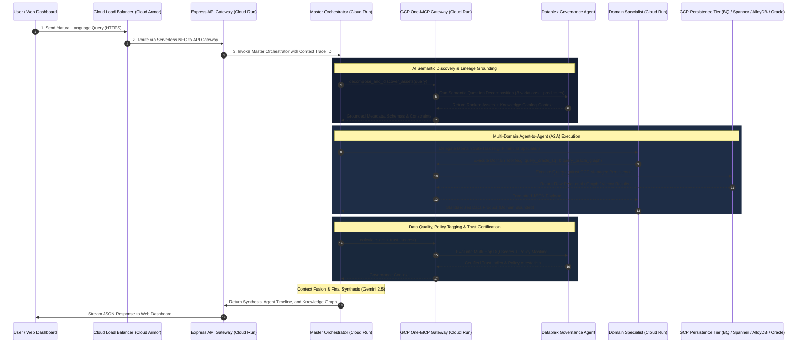

# Technical Deployment Blueprint: Agentic Data Mesh on GCP

*High-definition architectural blueprint of the MeshOS Agentic Data Mesh on Google Cloud Platform.*

This document provides a deep-dive into the technical service configuration, reactive data flows, and zero-trust security boundaries for the **MeshOS** Agentic Data Mesh on Google Cloud Platform.

---

## 1. System Component Mapping

| Layer | Component | GCP Service | Configuration & Enterprise Role |
| :--- | :--- | :--- | :--- |
| **Ingress & Perimeter** | Global Entry Point | **Cloud Armor + Global Load Balancer** | Layer 7 WAF, DDoS protection, SSL termination, and CDN caching. |
| | API Gateway | **Cloud Run Gateway / Apigee** | JWT validation, rate limiting, and request tracing with Cloud Trace. |
| **Orchestration Plane** | Master Orchestrator | **Cloud Run (Serverless)** | Runs Gemini 2.5 Flash / Pro reasoning engine, Context Fusion, and Data Contract validation. |
| **Unified Access Gateway** | GCP One-MCP Gateway | **Cloud Run (SSE on Port 8088 / Stdio)** | Centralized MCP server aggregating 31+ tools across 9 domains with zero-trust domain scoping. |
| **Governance & Discovery** | Dataplex Labs Governance Agent | **Cloud Run + Dataplex v1** | Document RAG engine, lineage-based description propagation, policy tags, and AutoDQ Trust Center. |
| | Dataplex Labs Discovery Agent | **Cloud Run + Vertex AI** | Semantic query decomposition, multi-search with `semantic_search: true`, and `lookupContext` API calls. |
| **Decentralized Domains** | 9 Domain Specialists | **Cloud Run Microservices** | Specialized domain agents (BigQuery, Spanner, AlloyDB, Oracle DB, NetSuite, Warehouse, HR, Catalog, API). |
| **Persistence Tier** | Analytical Warehouse | **BigQuery** | Serverless data warehouse with BigQuery ML models for churn risk. |
| | Global Relational & Graph | **Cloud Spanner** | Multi-region globally distributed database with Spanner Graph and native Vector indexing (`ARRAY<FLOAT32>`). |
| | Operational CRM | **AlloyDB for PostgreSQL** | Managed high-performance database with `pgvector` indexing for ticket semantic similarity. |
| | Mission-Critical ERP | **Oracle DB@GCP / BMS** | Oracle Exadata Database Service / Bare Metal Solution with Oracle AI Vector Search & Graph. |
| | SaaS Cloud ERP | **NetSuite SuiteTalk** | Secure REST/OAuth2 connector for sales orders and inventory receipts. |
| **Security & Observability**| Identity Management | **Cloud IAM + Workload Identity** | Least-privilege service accounts per domain; Zero-Trust tool authorization. |
| | Secret Management | **Google Secret Manager** | Secure storage and runtime mounting of API keys, DB credentials, and OAuth tokens. |
| | Logging & Audit | **Cloud Logging + Cloud Monitoring** | Unified logging with `CLOUD_LOGGING_ONLY` and Cloud Trace distributed tracing. |

---

## 2. Technical Data Flow & Lifecycle

```mermaid
sequenceDiagram
    autonumber
    participant U as User / Web Dashboard
    participant LB as Cloud Load Balancer (Cloud Armor)
    participant AG as Express API Gateway (Cloud Run)
    participant OR as Master Orchestrator (Cloud Run)
    participant MCP as GCP One-MCP Gateway (Cloud Run)
    participant GOV as Dataplex Governance Agent
    participant SA as Domain Specialist (Cloud Run)
    participant DB as GCP Persistence Tier (BQ / Spanner / AlloyDB / Oracle)

    U->>LB: 1. Send Natural Language Query (HTTPS)
    LB->>AG: 2. Route via Serverless NEG to API Gateway
    AG->>OR: 3. Invoke Master Orchestrator with Context Trace ID

    rect rgb(20, 30, 50)
        Note over OR,GOV: AI Semantic Discovery & Lineage Grounding
        OR->>MCP: decompose_and_discover_assets(query)
        MCP->>GOV: Run Semantic Question Decomposition (3 variations + predicates)
        GOV-->>MCP: Return Ranked Assets + Knowledge Catalog Context
        MCP-->>OR: Grounded Metadata, Schemas & Constraints
    end

    rect rgb(30, 45, 70)
        Note over OR,DB: Multi-Domain Agent-to-Agent (A2A) Execution
        OR->>SA: Delegate Domain Sub-Task (e.g. Financial Specialist)
        SA->>MCP: Execute Domain Tool (e.g. query_oracle_sql & query_oracle_graph)
        MCP->>DB: Execute Query against GCP Managed Persistence
        DB-->>MCP: Return Raw Relational / Graph / Vector Results
        MCP-->>SA: Formatted JSON Payload
        SA-->>OR: Standardized Data Product (Domain Bounded)
    end

    rect rgb(25, 40, 60)
        Note over OR,GOV: Data Quality, Policy Tagging & Trust Certification
        OR->>MCP: calculate_data_trust_scores()
        MCP->>GOV: Evaluate Multi-Hop DQ Scores + Policy Masking
        GOV-->>MCP: Certified Trust Index & Policy Attestation
        MCP-->>OR: Governance Context
    end

    Note over OR: Context Fusion & Final Synthesis (Gemini 2.5)
    OR->>AG: Return Synthesis, Agent Timeline, and Knowledge Graph
    AG->>U: Stream JSON Response to Web Dashboard
```

---

## 3. GraphRAG Grounding & Multimodal Verification

The platform implements **GraphRAG (Graph Retrieval-Augmented Generation)** to anchor LLM responses in verifiable database topologies:

1. **Entity Extraction & Resolution**: Domain agents extract structured entities from raw relational rows and unstructured documents.
2. **Graph Traversal Queries**: Pathfinding queries are executed against **Cloud Spanner Graph** (`MATCH (s:Store)-[:STOCKS]->(i:Inventory)-[:SOURCED_FROM]->(sup:Supplier)`) and **Oracle Graph**.
3. **Hybrid Vector Grounding**: Embeddings from **AlloyDB (`pgvector`)** and **Spanner Vector Search** enrich traversal paths with semantic similarity matches.
4. **Immutable Fact Citations**: The Master Orchestrator synthesizes answers while explicitly citing verified graph paths, eliminating hallucination.

---

## 4. Zero-Trust Security & Network Architecture

```mermaid
graph TD
    subgraph "Public Ingress Zone"
        Internet((Internet)) --> WAF[Cloud Armor WAF]
        WAF --> GLB[Global External HTTP(S) Load Balancer]
        GLB --> UIXService[Cloud Run: React UIX Studio]
        GLB --> APIService[Cloud Run: Express Mesh API]
    end

    subgraph "Private Serverless VPC Network (10.0.0.0/16)"
        APIService -->|Direct VPC Egress| OrchestratorService[Cloud Run: Master Orchestrator]
        OrchestratorService -->|Internal IAM Authenticated| OneMCPService[Cloud Run: GCP One-MCP Gateway]
        
        OneMCPService --> GovService[Cloud Run: Dataplex Governance Agent]
        OneMCPService --> DiscService[Cloud Run: Dataplex Discovery Agent]
        OneMCPService --> DomainServices[Cloud Run: 9 Domain Specialists]
    end

    subgraph "GCP Private Data Services"
        DomainServices -.->|Private Service Connect| AlloyDBPSC[AlloyDB Cluster]
        DomainServices -.->|VPC Network Peering| OracleVPC[Oracle DB@GCP Exadata]
        DomainServices -.->|Google Private APIs| SpannerPrivate[Cloud Spanner Instance]
        DomainServices -.->|Google Private APIs| BigQueryPrivate[BigQuery Enterprise Datasets]
        GovService & DiscService -.->|Google Private APIs| DataplexPrivate[Dataplex / Knowledge Catalog API]
    end
```

### Security Guardrails
- **Service-to-Service Authentication**: Internal Cloud Run services require Google OIDC authentication tokens with `roles/run.invoker`.
- **Domain Tool Isolation**: MCP Gateway inspects agent identity tokens to restrict tool execution strictly to authorized domains.
- **Dynamic Policy Tags & DLP Masking**: Sensitive fields (`EMAIL`, `CREDIT_CARD`, `SALARY`) are tagged with Dataplex Taxonomy Policy Tags and masked in transit.
- **Secret Zero-Exposure**: Secret Manager injects database credentials dynamically into memory without storing tokens on disk or in container layers.
